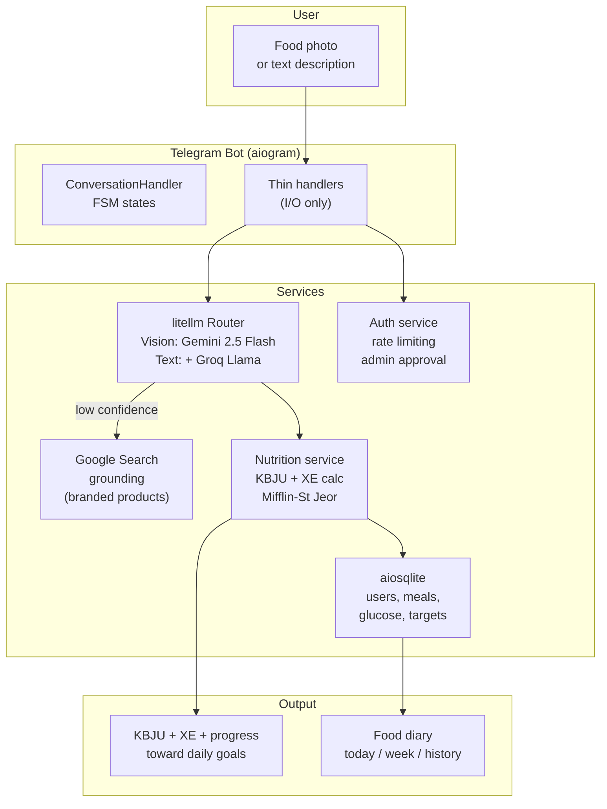
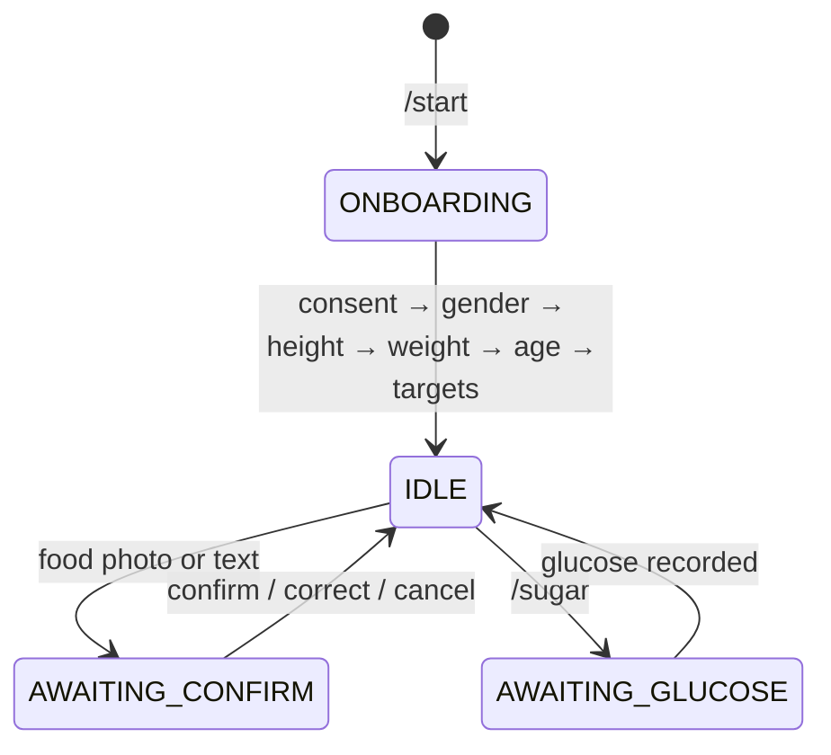

# DiaBot: AI Nutrition Assistant for Type 1 Diabetes

## Context

A close family member has type 1 diabetes. Every meal is a math problem: estimate the carbohydrates on the plate, convert to bread units (XE), calculate the insulin dose. An error of 1-2 XE can lead to hypoglycemia or hyperglycemia — hospitalization, loss of consciousness, coma. This happens 4-6 times a day, every day, for the rest of their life.

I watched this process and thought: the estimation step is the bottleneck. The math is simple once you know the carbs. But knowing the carbs in a mixed plate by eye is where humans fail consistently.

## Problem

Three specific issues with manual carb counting:

1. **Estimation error** — eyeballing 200g of pasta vs 250g is a 10g carb difference, which is almost 1 XE. Over a day of 4-6 meals, errors compound.
2. **Branded product confusion** — is this specific yogurt 8g or 15g carbs per serving? Different brands, different formulations, sometimes different by country.
3. **Fatigue** — doing mental math 4-6 times a day, every day, with real medical consequences for mistakes, is exhausting. People start estimating poorly because they're tired of estimating carefully.

Existing apps either require manual food database lookup (tedious) or are calorie-focused (wrong priority for T1 diabetes — insulin dosing depends on carbs, not calories).

## Approach

One action: **snap a photo, get the result**. The bot recognizes food via Gemini Vision AI, calculates KBJU (calories, protein, fat, carbs) and bread units, and logs it to a food diary.

Key design decisions:

- **Carb accuracy over calorie accuracy** — this is an architectural decision, not just a UI choice. It's reflected in LLM prompts (carb precision is prioritized), display formatting (carbs and XE always shown first), and the two-step confirmation flow (user verifies carb-critical items).
- **Two LLM chains** — Vision chain (Gemini 2.5 Flash / OpenRouter) for photo recognition. Text chain adds Groq/Llama as a cheaper fallback for text-only inputs. litellm Router handles automatic failover.
- **Google Search grounding** — when the primary model returns low-confidence results for branded products, a separate `google-genai` call with Search grounding retrieves accurate nutrition data for that specific brand.
- **Photos never touch disk** — only Telegram `file_id` is stored. The image is fetched on-demand from Telegram servers and passed directly to the LLM API as bytes. No photo storage, no privacy risk.
- **Two-step flow** — recognize, then confirm. The bot shows what it recognized and the user corrects if needed before saving. This catches the most dangerous errors (wrong portion size, misidentified food).

## Architecture

### State machine

## Impact

| Metric | Value |
|--------|-------|
| Tests | 72 automated (pytest) |
| Languages | Bilingual (Russian / English) |
| LLM chains | 2 (vision + text with auto-failover) |
| Onboarding | 5-step (gender, height, weight, age, targets) |
| Daily targets | Auto-calculated via Mifflin-St Jeor or manual override |
| Privacy | GDPR-compatible: /export (JSON), /delete_my_data |
| Photos | Never saved to disk — Telegram file_id only |
| Multi-user | Self-hosted with admin approval workflow |
| License | MIT |

### Features

- Photo recognition with portion estimation
- Text-based food input
- Photo + caption for context
- Branded product lookup via Google Search grounding
- Configurable XE coefficient (default 12g carbs = 1 XE)
- Visual progress bars toward daily goals
- Weekly statistics
- Glucose readings tracking (/sugar)
- Full data export and deletion

## Design philosophy

**Handlers are thin.** All business logic lives in `services/`. Handlers only do I/O — Telegram API calls, user input parsing. This makes the business logic testable without Telegram infrastructure.

**No ORM.** Plain SQL with aiosqlite. The schema (users, meals, glucose, targets) is simple enough that SQLAlchemy would add complexity without benefit.

**Locales contain LLM prompts.** Unlike most projects that separate prompts into their own directory, DiaBot ties prompts to language. The Russian prompt asks for results in Russian units and terminology. The English prompt uses English conventions. This is intentional — the prompt IS the language-specific behavior.

**Reply keyboard for navigation, inline keyboard for confirmation only.** This UX decision came from watching the user interact: navigation (diary, settings, help) should be one-tap persistent buttons. Confirmation (accept/correct/cancel recognition results) should be inline buttons that disappear after use.

## Reflection

"I solve mine, then ship to others." DiaBot started because someone I care about needed a tool that didn't exist. The medical urgency (carb counting errors have real consequences) shaped every design decision — carb accuracy over calorie accuracy, two-step confirmation, Google Search grounding for edge cases.

The most unexpected insight: the two-step flow (recognize then confirm) is more important than recognition accuracy. A 90% accurate recognizer with human confirmation is better than a 99% accurate recognizer without it — because the 1% error in carb counting has medical consequences.

Building for a single, known user first (then opening to others) is a different design discipline than building for an abstract market. You can't hide behind personas or user stories. The person who will use this is sitting next to you, and they'll tell you immediately if it's wrong.

**Source:** [github.com/CreatmanCEO/diabot](https://github.com/CreatmanCEO/diabot)
