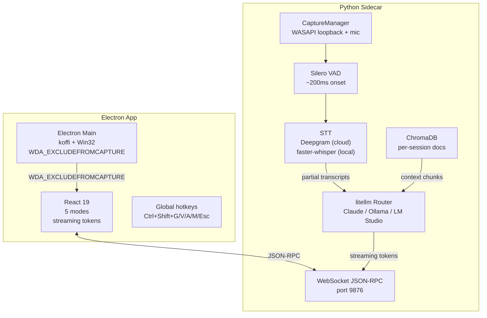
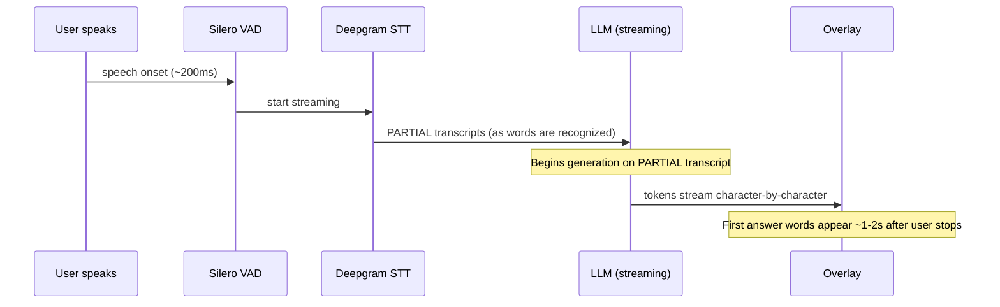

# GHOST: Invisible AI Assistant for Windows

## Context

Screen recordings, screen sharing, live interviews, presentations — these are situations where you might want AI assistance but can't visibly have it. Every existing AI overlay is captured by OBS, Zoom, Teams, Google Meet, and Discord screen-sharing APIs. The moment you share your screen, everyone sees your AI assistant.

I analyzed every meaningful competitor in this space: Cluely ($75/mo, stealth-only, no offline), Screenpipe (16K stars, no invisible overlay), Natively (open-source RAG, no stealth), Interview Hunter, Interview Coder, Final Round AI. Each does one or two things well. None combines stealth + multi-mode + multi-provider LLM + RAG + offline-capable + streaming-first response.

## Problem

Four specific problems in the AI overlay space:

1. **10-30 second response delay** — most tools wait for the full question, then for the full LLM response, then render. In a live interview, 30 seconds of silence is death.
2. **Generic answers** — without context (CV, job description, company notes), the assistant sounds like ChatGPT, not like you.
3. **Detection despite "stealth" claims** — many competitors' stealth fails silently in modern Zoom/Teams updates.
4. **Cloud-only dependency** — privacy-conscious users want a local-LLM option for sensitive contexts.

## Approach

The core technical innovation is a single Win32 API call:

```
SetWindowDisplayAffinity(windowHandle, WDA_EXCLUDEFROMCAPTURE)
```

`WDA_EXCLUDEFROMCAPTURE` (0x00000011, Windows 10 v2004+) tells the OS to render the window to the physical display but exclude it from all screen-capture APIs — including Desktop Duplication API, DirectX capture, and the APIs used by Zoom, Teams, Meet, Discord, and OBS.

This isn't a hack or a workaround. It's a documented Win32 API designed for DRM-protected content playback. GHOST repurposes it for an AI overlay.

The architecture is a two-process design:

- **Electron renderer** — React 19 + Vite + Tailwind + Zustand. Invisible overlay UI with 5 specialized modes (Interview, Meeting, Coding, Learning, General).
- **Python sidecar** — asyncio + websockets. Silero VAD for speech detection, Deepgram or faster-whisper for STT, litellm for multi-provider LLM routing, ChromaDB for per-session RAG.

The two processes communicate via WebSocket JSON-RPC on localhost. This clean boundary means the UI and inference can be developed, tested, and deployed independently.

## Architecture



### Latency pipeline

The streaming-first design is what separates GHOST from competitors:



Most competitors wait for: end of utterance, then full transcript, then full LLM response, then render. Total: 10-30 seconds. GHOST's pipeline begins LLM generation on partial transcripts — the first answer tokens appear before the user finishes speaking.

## Impact

| Metric | Value |
|--------|-------|
| Platform | Windows 10 v2004+ / Windows 11 |
| Stealth method | WDA_EXCLUDEFROMCAPTURE (OS-level, not a hack) |
| LLM providers | Claude, Ollama, LM Studio (no cloud required) |
| STT providers | Deepgram (cloud), faster-whisper (local) |
| Audio capture | WASAPI loopback + microphone (dual-source) |
| RAG | ChromaDB, per-session document upload (CV, JD, notes) |
| Modes | 5 (Interview, Meeting, Coding, Learning, General) |
| Offline capable | Yes — Ollama + faster-whisper = 100% local |
| Target latency | First-reply-tokens within 1-2s of end-of-utterance |
| Status | Phase 1 active development |

## Design decisions

**Why Electron + Python sidecar, not a single-process app?**

The invisible overlay requires native Win32 API access (`koffi` FFI in Electron main process). The inference pipeline (VAD, STT, LLM, RAG) is Python-native. A WebSocket boundary between them is cleaner than trying to run Python inference inside Electron or building the entire UI in Python.

**Why 5 modes instead of one general assistant?**

Each mode is an opinionated system prompt + UI affordance, not a separate model. Interview mode provides algorithm hints and complexity analysis. Meeting mode captures action items. Coding mode does documentation lookup. The mode system means the AI's answers are contextually appropriate without the user having to explain "I'm in an interview right now."

**Why multi-provider LLM?**

Different situations have different requirements. A live interview needs the fastest provider (Claude Haiku or local Ollama). Deep coding needs the smartest (Claude Opus). A privacy-sensitive meeting needs 100% local (Ollama + faster-whisper). The litellm router makes this configurable per mode.

## Reflection

GHOST is a niche Windows hack that solves a real problem. The `WDA_EXCLUDEFROMCAPTURE` API is documented but underutilized — its intended use is DRM content playback, not AI overlays. Repurposing it for this use case is the kind of lateral thinking that comes from reading Win32 documentation for fun.

The streaming-first pipeline design is the real engineering contribution. Most AI tools optimize for answer quality. In a live conversation, latency matters more than the last 5% of answer quality. Starting LLM generation on partial STT transcripts is counterintuitive but effective — the LLM can infer the full question from the first few words most of the time.

Phase 2 (macOS/Linux ports, auto-update, installer, payment) is the gap between "working prototype" and "shippable product." The core technology works. The product shell needs polish.

**Source:** [github.com/CreatmanCEO/ghost-showcase](https://github.com/CreatmanCEO/ghost-showcase) | Status: open to investment / acquisition
