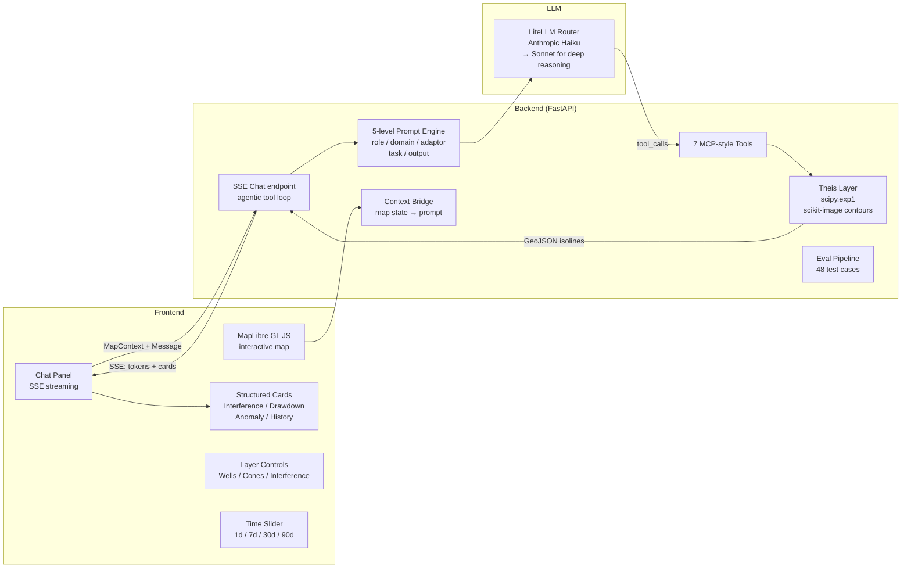
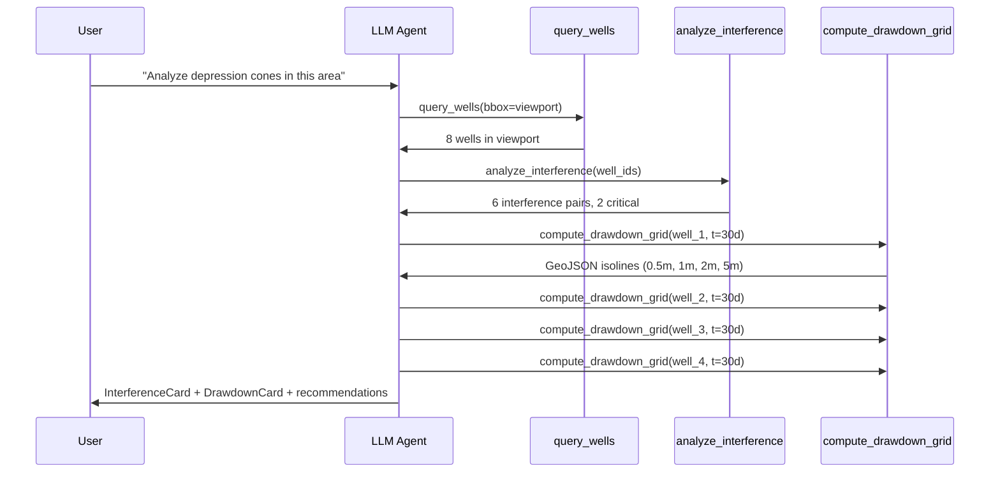

# HydroWatch: Groundwater Monitoring with an LLM Agent

## Context

I spent 17 years as a field geologist — hydrogeological surveys, well monitoring, aquifer analysis. The work involves real math: Theis equation for well interference, depression cone modeling, time-series analysis for anomaly detection. The tools available are either too academic (MODFLOW requires a coupled numerical solver and weeks of setup) or too shallow (dashboards with cosmetic icons that don't compute anything real).

When I transitioned to software engineering, this domain stayed with me. HydroWatch is the project that bridges two careers — encoding geological knowledge into software that an LLM agent can use.

## Problem

Groundwater monitoring has three specific technical challenges:

1. **Well interference** — when multiple wells pump from the same aquifer, each well's drawdown affects its neighbors. The relationship is asymmetric: Well A might dominate Well B (donor/victim) depending on transmissivity, distance, and pumping rates. Computing this requires the Theis equation with superposition.
2. **Depression cone visualization** — the cone of depression around a pumping well grows over time. Visualizing it requires computing Theis drawdown on a spatial grid, then extracting isolines at meaningful drawdown levels (0.5m, 1m, 2m, 5m). This is real contour extraction, not concentric circles.
3. **Anomaly interpretation** — a declining debit trend might be seasonal, might indicate aquifer depletion, or might be a sensor fault. Distinguishing these requires domain knowledge that most monitoring tools don't have.

## Approach

A full-stack application with real hydrogeology math, an interactive map, and an LLM agent that calls 7 MCP-style tools to answer professional questions.

Key design decisions:

- **Analytical Theis over numerical MODFLOW** — the Theis equation (scipy.special.exp1) gives accurate results for confined aquifer interference in 15 lines of code. MODFLOW would require a coupled numerical solver, grid discretization, and boundary condition setup. For monitoring and screening, analytical is the right choice. (Documented in ADR-0003.)
- **Marching-squares contour extraction** — depression cone isolines are real Theis-based polygons generated server-side via `scikit-image.measure.find_contours`. Not circles, not approximations — actual isolines from a computed drawdown grid with superposition from neighboring wells.
- **Context bridge pattern** — map state (viewport, visible layers, selected well, cone time step, interference visibility) is serialized into every LLM prompt. The agent answers about what the user is looking at, not generic data. (ADR-0004.)
- **Bounded agentic loop** — max 6 iterations. A question like "analyze depression cones in this area" triggers `query_wells` then `analyze_interference` then 4x `compute_drawdown_grid` — the agent chains tool calls until it has enough data for a multi-page recommendation.
- **Structured output cards** — `InterferenceCard`, `DrawdownCard`, `AnomalyCard`, `WellHistoryChart` (Recharts time-series). The LLM doesn't return raw text — it returns typed cards that the frontend renders with proper visualization.

## Architecture

### Tool chain example

## Impact

| Metric | Value |
|--------|-------|
| Backend tests | 154 |
| MCP-style tools | 7 |
| Eval test cases | 48 across 5 categories |
| Architecture decisions | 6 documented ADRs |
| Frontend | Next.js 15 + TypeScript + MapLibre + Recharts |
| Backend | FastAPI + Python 3.12 + scipy + scikit-image |
| LLM | Anthropic Haiku / Sonnet via OpenRouter + LiteLLM |
| Map features | Gradient interference lines, Theis isolines, time slider |
| Structured cards | InterferenceCard, DrawdownCard, AnomalyCard, WellHistoryChart |
| Data | Synthetic: 25 wells x 4 clusters, 365-day time series |

### The 7 tools

| Tool | Purpose |
|------|---------|
| `analyze_interference` | Theis pair coefficients with donor/victim classification |
| `compute_drawdown_grid` | Theis isoline polygons with superposition |
| `query_wells` | Spatial/status/cluster filtering |
| `get_well_history` | Time series with linear regression trend |
| `detect_anomalies` | Debit decline, TDS spike (3-sigma), sensor faults |
| `get_region_stats` | Aggregated statistics for viewport |
| `validate_csv` | Column validation with statistics for data upload |

## Domain-specific engineering

### Interference lines

The color gradient along each interference line shows asymmetric drawdown coefficients. A red end means "this well is the victim" (neighbor dominates). A green end means "minimally affected, this well is the donor." The label `87% / 6.83m` shows the maximum coefficient and combined drawdown at the midpoint.

This is not a cosmetic visualization. The asymmetry comes from the Theis equation: drawdown at a point depends on the pumping rate, transmissivity, storativity, and distance. Two wells at the same distance but different pumping rates will have asymmetric interference.

### Depression cones

Real isolines, not concentric circles. The `compute_drawdown_grid` tool:
1. Creates a spatial grid around the target well
2. Computes Theis drawdown at each grid point, including superposition from neighbors within 5km
3. Extracts contours at 0.5m, 1m, 2m, 5m drawdown levels using `scikit-image.measure.find_contours`
4. Converts contours to GeoJSON polygons
5. Time slider shows cone evolution: 1 day, 7 days, 30 days, 90 days of continuous pumping

## Reflection

HydroWatch is the project that proves domain expertise transfers. The Theis equation is not something you learn from a tutorial — it's something you use hundreds of times in the field, developing intuition for when it applies (confined aquifers, steady-state assumptions) and when it doesn't (leaky aquifers, boundary effects).

The decision to use analytical Theis over numerical MODFLOW (ADR-0003) is the most domain-informed decision in the project. A software engineer without hydrogeology background would default to the "more powerful" numerical approach. But for monitoring and screening — which is what field geologists actually do most of the time — the analytical solution is faster, more interpretable, and sufficient.

The context bridge pattern (ADR-0004) is the LLM engineering insight: serializing the map state into every prompt means the agent's answers are grounded in what the user is looking at, not in abstract database queries. When a user asks "what's happening here?" the agent knows which wells are visible, which layers are active, and what time step the cone slider is showing.

154 tests. Real math. A genuine bridge between two careers and two decades.

**Source:** [github.com/CreatmanCEO/hydrowatch](https://github.com/CreatmanCEO/hydrowatch)
