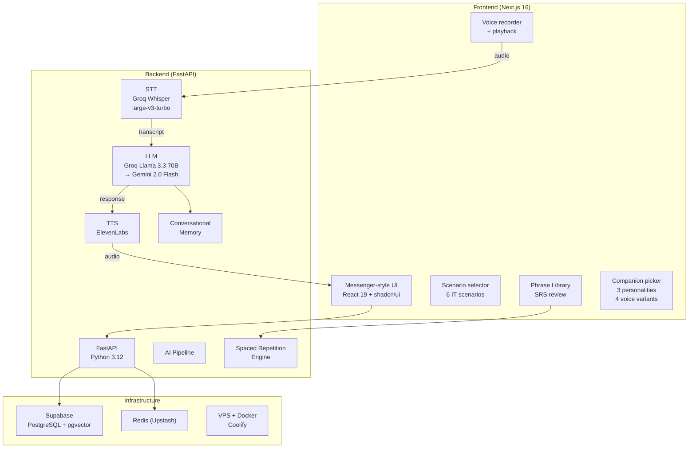
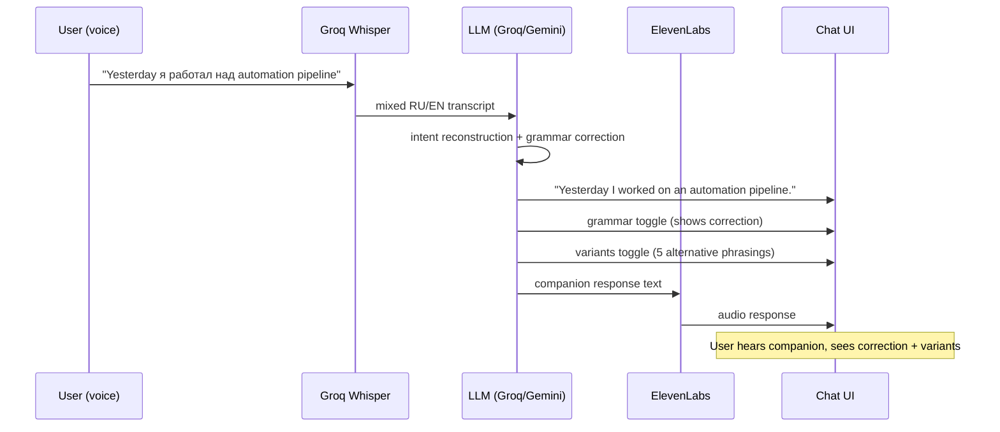

# Lingua Companion: Voice-First Language Learning

## Context

Russian-speaking IT professionals live in a bilingual world. Stand-ups are in English, Slack is in English, documentation is in English — but thinking happens in Russian, and technical conversations constantly code-switch between the two languages.

Existing language apps don't understand this reality. Duolingo teaches isolated vocabulary. ChatGPT conversations lack pedagogical structure. Language exchange apps pair you with strangers who don't understand tech context. None of them handle a sentence like "Yesterday I was working on the automation pipeline" spoken as "Yesterday я работал над automation pipeline" — which is how actual Russian-speaking developers talk.

## Problem

Four specific gaps in the language learning market for this audience:

1. **No code-switching support** — when a Russian speaker says a sentence that mixes Russian and English words, existing STT systems either fail entirely or transcribe it as one language with garbage.
2. **No IT context** — language learning apps don't know what a "sprint planning" or "code review" is. They can't simulate a technical interview or a daily stand-up.
3. **Text-first design** — most apps are text-based with voice bolted on. For speaking practice (the actual skill gap), voice needs to be primary.
4. **No conversational memory** — every session starts fresh. The app doesn't know your weak points, your interests, or your learning history.

## Approach

Voice-first conversational platform with native bilingual support. The user speaks (in any mix of Russian and English), the companion understands, corrects, and continues the conversation.

Key design decisions:

- **Voice-first, not voice-added** — the UI is a messenger-style chat where voice messages are the primary input. Text works as fallback, but the design assumes voice.
- **Groq Whisper large-v3-turbo for STT** — handles Russian/English mixed speech natively. The Groq inference is fast enough for conversational latency.
- **Three companion personalities** — Alex (professional, formal), Sam (casual, friendly), Morgan (mentor, patient). Each has a distinct communication style and voice. This isn't cosmetic — different learning contexts need different interaction patterns.
- **Four voice variants** — US Male, US Female, GB Male, GB Female via ElevenLabs TTS. Voice selection is per-companion.
- **Scenario-based practice** — 6 IT-specific scenarios at B1/B2 CEFR levels: Daily Stand-up, Code Review, Tech Demo, Job Interview, Sprint Planning, Write a Slack Message. Each scenario has structured phases and evaluation criteria.
- **Spaced repetition phrase library** — phrases from conversations are saved, tagged (Professional/Slang), and reviewed on an SRS schedule (Forgot/Hard/Easy buttons).

## Architecture

### Conversation flow

## Impact

| Metric | Value |
|--------|-------|
| Backend tests | 91 passing |
| E2E tests | 10/11 Playwright |
| Companion personalities | 3 (Alex, Sam, Morgan) |
| Voice variants | 4 (US/GB x Male/Female) |
| Scenarios | 6 IT-specific (B1/B2 CEFR) |
| Frontend | Next.js 16 + React 19 + shadcn/ui |
| Backend | FastAPI + Python 3.12 |
| STT | Groq Whisper large-v3-turbo |
| TTS | ElevenLabs (production confirmed) |
| LLM | Groq Llama 3.3 70B / Gemini 2.0 Flash |
| Database | Supabase (PostgreSQL + pgvector) |
| Features | Grammar toggle, 5-variant suggestions, phrase library, SRS, progress tracking |

### Per-message features

Every user message gets:
- **Grammar reconstruction** — the corrected version of what the user said, preserving their intent
- **Grammar toggle** — shows exactly what was corrected and why
- **Variants toggle** — 5 alternative ways to express the same idea, from formal to casual
- **Phrase save** — any phrase can be saved to the library for SRS review

## Why voice-first, not text-based

This was the foundational design decision. Arguments for voice-first:

1. **The skill gap is speaking, not reading.** Russian IT professionals can read English documentation fluently. They struggle with real-time spoken English in meetings and interviews.
2. **Code-switching is a spoken phenomenon.** You don't code-switch when typing — you do when talking. The STT system must handle mixed-language audio, which is a fundamentally different problem than mixed-language text.
3. **Pronunciation matters.** Text-based language practice doesn't help with pronunciation. Voice input enables phoneme-level analysis (Azure Speech SDK in Phase 2).
4. **Conversational rhythm.** Speaking practice requires back-and-forth at conversational speed. Text chat allows infinite thinking time, which doesn't simulate the real pressure of a live meeting.

## Reflection

The hardest technical problem was STT for mixed Russian/English speech. Most speech recognition systems are trained on monolingual data and fail catastrophically on code-switched input. Groq Whisper large-v3-turbo handles this surprisingly well — it's trained on multilingual data and doesn't force a single-language hypothesis.

The three-companion system emerged from testing. A single "AI tutor" personality is boring. But three distinct personalities — professional Alex for interview prep, casual Sam for Slack-style practice, mentoring Morgan for grammar deep-dives — create meaningfully different learning contexts. Users gravitate to different companions for different scenarios.

The phrase library with spaced repetition was a late addition that became a core feature. Users naturally want to save phrases they struggled with and review them later. Tying this to an SRS schedule (Forgot/Hard/Easy) turns casual conversation practice into structured learning without making it feel like homework.

**Source:** [github.com/CreatmanCEO/lingua-companion](https://github.com/CreatmanCEO/lingua-companion) | Status: private beta, open to partnership
