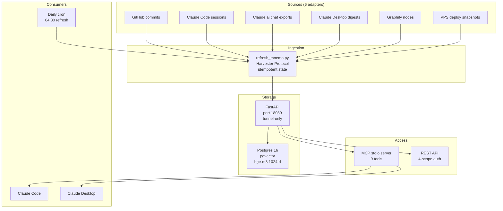

# MNEMO: Personal Event Graph with Semantic Recall

## Context

AI agents are amnesiac. Every Claude Code session starts from zero — no memory of yesterday's decisions, no recall of what was built last week, no awareness of the 15+ projects running in parallel. The operator re-explains the same project map, re-searches for the same events, re-establishes the same constraints. Every. Single. Time.

I had 14,000+ meaningful events scattered across GitHub commits, Claude.ai chat exports, Claude Code sessions, Claude Desktop digests, VPS deploy snapshots, and graphify knowledge nodes. All of it lived in silos with no unified access layer.

## Problem

Three specific pain points:

1. **Decision amnesia** — "Did I decide to use LiteLLM or direct provider calls for DiaBot?" Answer exists in a chat from two weeks ago, but finding it means grep-ing through exports.
2. **Context repetition tax** — every new session requires 5-10 minutes of re-orientation. Multiply by 10+ sessions/day across multiple devices.
3. **No narrative thread** — individual events exist, but no system connects "started lingua-companion" to "shipped Phase 1" to "pivoted voice stack from Deepgram to Groq Whisper."

Existing tools (Notion, Obsidian, manual notes) don't solve this because they require the operator to write things down. The whole point is that builders ship faster than they document.

## Approach

Event sourcing with content-addressed IDs (sha256). Every event is immutable and idempotent — re-ingesting the same commit or chat export produces the same event ID, so refresh runs are safe to re-run.

Key design decisions:

- **pgvector + bge-m3** for multilingual semantic search (Russian/English mixed queries work natively with 1024-d embeddings)
- **Time-decay re-ranking** with a 730-day half-life — recent events surface first, but old decisions don't disappear
- **Salience scoring** (0.0-1.0) — not everything is equally important; default filter at 0.5 cuts noise
- **Privacy enum gating** — `public` / `internal` / `private` events served by scope-based bearer tokens (4 scopes)
- **Soft-dedup** via `possible_duplicate_of` links — near-duplicates linked, not destroyed
- **Supersedes chain** — obsolete decisions marked, not deleted; filtered by default but recoverable

The MCP server exposes 9 tools to Claude Desktop and Claude Code. When I ask "what did I decide about the VPN migration?", Claude calls `mnemo_recall` and gets back timestamped, source-attributed events with confidence scores.

## Architecture

## Impact

| Metric | Value |
|--------|-------|
| Events ingested | 14,582 from 6 sources |
| Events embedded | 5,841 with bge-m3 |
| Recall latency (p50) | ~465 ms |
| Tests | 135 (122 main + 13 MCP) |
| Sprints completed | 5 major + 2 point releases |
| Build time | 12 days (Sprint 0 through 0.5.2) |
| Infrastructure | Single 4GB VPS, Docker Compose |
| Auth model | 4-scope bearer tokens |
| Daily refresh | Automated via cron (GitHub + VPS sources) |

The system runs 24/7 on a dedicated VPS. Migration from the original host to a dedicated machine was executed live with a 48-hour fallback window (documented in CHANGELOG 0.5.1).

## Sprint trajectory

| Sprint | Days | Delivered |
|--------|------|-----------|
| 0 | 1 | Schema v2 with salience, privacy, FTS. 14,581 events backfilled |
| 1 | 1 | Harvester Protocol, 6 adapters, orchestrator, cron |
| 1.5 | 0.5 | GitHub cache, VPS SSH mount, provenance fields |
| 2 | 0.5 | FastMCP stdio server, 5 read/refresh tools, voice format |
| 3 | 0.5 | pgvector + bge-m3 + /recall with cosine + time-decay |
| 4 | 1 | Skills table, eval traces, auto-deactivate on pass_rate < 0.7 |
| 0.5.1 | 1 | Infrastructure migration to dedicated host |
| 0.5.2 | 0.5 | Event content endpoint for deep-dive recall |

## Reflection

MNEMO started as "I need my AI to remember things." It became the foundation for everything else — Rotator reads from it, chronicles write to it, skills are stored in it.

The most important pattern that emerged: **observation-based skill creation**. Instead of prescribing what skills the system should have, I let the system run, observed which queries succeeded and which failed, then crystallized passing patterns into reusable skills. Skills with a pass rate below 0.7 auto-deactivate. This is Darwinian — only patterns that actually work survive.

The hardest engineering decision was choosing analytical Theis-style simplicity (pgvector cosine + time-decay) over a more complex retrieval pipeline. The 465ms p50 latency on a 4GB VPS validated that choice — good enough beats perfect every time when you're the only user.

**Source:** [github.com/CreatmanCEO/mnemo-showcase](https://github.com/CreatmanCEO/mnemo-showcase)
