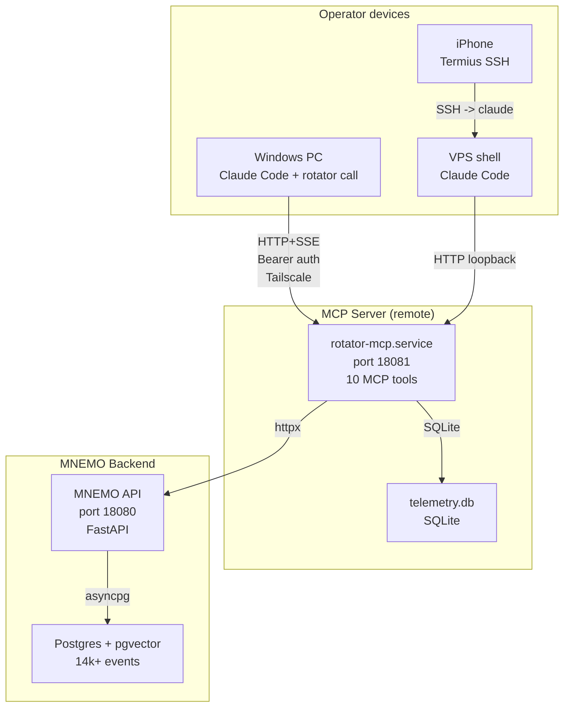
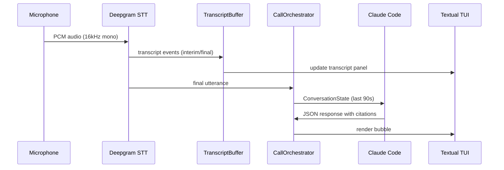

# Rotator: Voice Co-pilot and Agent Runtime

## Context

After building MNEMO as a memory layer, the next question was obvious: how does an AI agent use that memory in real time? The answer should include voice — because most of my thinking happens out loud, not at a keyboard.

I needed an agent runtime that treats Claude Code as the brain, not as a subprocess. Something that gives Claude persistent memory, voice input, hierarchical summaries, and self-telemetry — without reimplementing what Claude Code already does natively.

## Problem

The first version of Rotator was a classifier + squads orchestrator. It spawned Claude Code as a subprocess for "execute_code" tasks, with bounded loops, researcher/executor/browser/observer squads, and a classifier that routed incoming requests.

After 6 days of building this, I diagnosed the design as fundamentally backwards:

1. **Orchestration overhead** — the classifier was re-implementing 1/10th of what Claude Code already does natively (planning, multi-step tool composition, conversation memory, file reading, shell access)
2. **No persistent skills** — skills extracted from one session disappeared by the next
3. **No voice** — my primary thinking mode (walking, driving, commuting) had no input channel
4. **Fragmentation across devices** — Windows laptop, VPS shell, iPhone via SSH — each was an island with no shared memory

## Approach

The fix was an architectural inversion. Instead of Rotator containing an LLM loop that spawns Claude Code, Claude Code became the brain and Rotator became its peripheral.

The classifier died. The squads died. The bounded loop died. What survived: an MCP server exposing memory, voice, and telemetry as tools that Claude Code calls at will.

Key design decisions:

- **MCP peripheral pattern** — Rotator is a tool provider, not an orchestrator. Claude Code decides when and how to use each tool.
- **Dual transport** — stdio for local use, streamable-HTTP with Bearer auth for remote. Every device wires to the same Tailscale-fronted URL.
- **Hierarchical chronicles** — daily/weekly/monthly narrative summaries built from raw MNEMO events and posted back. This creates a multi-resolution view of work history.
- **Voice co-pilot** — mic to Deepgram STT to transcript to Claude Code subprocess, with a Textual TUI showing live transcript and structured responses.
- **Self-telemetry** — every tool call is timed and logged to SQLite. Claude self-reports tool usefulness at session end. The `waste` signal is the most valuable — it drives improvements.

## Architecture

### Voice pipeline

## Impact

| Metric | Value |
|--------|-------|
| MCP tools | 10 (memory 5 + chronicle 1 + notes 1 + voice 1 + telemetry 1 + skills 1) |
| Unit tests | 262, all passing |
| Python modules | 76 files in `src/rotator/` |
| LOC | ~3,300 |
| Build time | 5 days scaffold to release + 3 days voice + telemetry |
| Transports | stdio (local) + streamable-HTTP (remote, Bearer auth) |
| Devices connected | Windows PC + VPS + iPhone — same MCP endpoint |

### MCP tools

| Tool | Purpose |
|------|---------|
| `mnemo_recall` | Semantic search (cosine x time-decay x salience) |
| `mnemo_events` | Temporal event listing |
| `mnemo_event_content` | Full transcript/body of a single event |
| `mnemo_write` | POST a new event |
| `mnemo_state` | Health check and counts |
| `chronicle_build` | Hierarchical chronicle (daily/weekly/monthly) |
| `session_note` | Append free-form note to session file |
| `call_consult` | Voice co-pilot brain dispatch |
| `rotator_self_report` | Tool usefulness self-report |
| `skill_lookup` | Search skills in MNEMO |

## The inversion — ADR-2026-05-20

This is the strongest architectural signal in the project. The full ADR documents recognizing when your own abstraction is worse than the platform you are building on, and having the discipline to throw it away.

Before: Rotator spawns Claude Code as a subprocess, wrapping it in a classifier + squads + bounded loop.

After: Claude Code is the brain. Rotator is a peripheral that extends it with memory, voice, and telemetry. One `claude mcp add --transport http` command and all 10 tools are available on any device.

The legacy orchestrator code is preserved (deprecated, kept for cron-only paths) but no longer used interactively. This is honest deprecation — the code exists, the design is documented, and the reason for abandoning it is explicit.

## Reflection

The pivot from "orchestrator that contains Claude" to "peripheral that extends Claude" eliminated hundreds of lines of classifier/router/squad logic and replaced them with a clean MCP interface. The new architecture is simpler, more testable, and works across devices — something the orchestrator pattern could never achieve.

Voice as primary input channel changed how I think about agent interaction. Walking and dictating a session note is qualitatively different from sitting at a keyboard. The Textual TUI with live transcript makes this feel like a real conversation, not a CLI prompt.

The self-telemetry loop (tool call timing + usefulness self-reports) is underrated. When Claude reports a tool as `waste`, that is the signal that drives the next improvement. Most agent frameworks optimize for capability; this one also optimizes for honesty about what works and what doesn't.

**Source:** [github.com/CreatmanCEO/rotator-showcase](https://github.com/CreatmanCEO/rotator-showcase)
