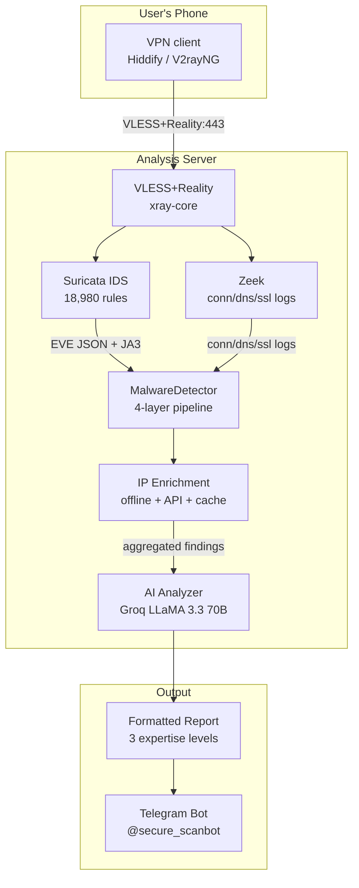

# Security Scanner: Mobile Threat Detection via VPN Traffic Analysis

## Context

A friend's phone was compromised. Not a sophisticated nation-state attack — commodity stalkerware, the kind that monitors location, reads messages, and exfiltrates data in the background. The phone showed no obvious symptoms. The friend had no technical skills to investigate.

I looked for an accessible tool that a non-expert could use to check their phone for malware. There wasn't one. The options were either enterprise-grade ($$$), required root/jailbreak, or were so shallow they only scanned installed app names against a blocklist.

## Problem

Mobile malware detection is hard for three reasons:

1. **No filesystem access** — unlike desktops, mobile OSes sandbox apps. You can't just run a virus scanner that reads every file.
2. **Expertise barrier** — tools like Wireshark or tcpdump exist, but interpreting packet captures requires specialized knowledge.
3. **Detection evasion** — modern malware uses standard ports (443), legitimate CDNs, and encrypted channels. Simple port-based detection misses everything sophisticated.

The gap: there is no tool that a normal person can use on their unmodified phone to detect whether it is communicating with known malware infrastructure.

## Approach

The insight: you can't inspect what's on the phone, but you can inspect what leaves it. Route all phone traffic through a VPN tunnel to a server running IDS/network analysis, then analyze the metadata — no TLS interception, no MitM, no CA certificate installation.

The detection pipeline has four layers:

1. **Layer 1: Ports** — instant detection of known-bad ports (SSH, Telnet, ADB, Metasploit, SpyNote, AhMyth, AndroRAT, mining pools, IRC botnets)
2. **Layer 2: Behavior** — beaconing detection (C2 callbacks with CV < 0.30), data exfiltration (>10MB upload to unknown), camera/mic streaming (sustained upload >500KB), keylogger patterns (frequent small POST <5KB), DNS tunneling (queries >60 chars)
3. **Layer 3: Blacklists** — 919 stalkerware domains (AssoEchap), mining pool domains, dynamic DNS domains (C2 infrastructure)
4. **Layer 4: JA3 TLS Fingerprinting** — 97 malware fingerprints from abuse.ch SSLBL. Detects malware by its TLS handshake even on port 443.

After the pipeline runs, an AI analyzer (Groq LLaMA 3.3 70B with Gemini fallback) generates a human-readable report at three expertise levels: beginner, intermediate, or expert.

## Architecture

## Detection details

### False positive mitigation

This was the hardest engineering problem — more important than detection itself. A false positive that tells a scared, non-technical user "your phone is compromised" when it isn't is worse than a false negative.

Mitigations:

- **Server IP filtering** on 3 levels — the analysis server's own traffic is excluded from results
- **Safe prefixes** — Google, Apple, Yandex, VK, Fastly, Cloudflare, AWS, Meta traffic classified as known infrastructure
- **AbuseIPDB score override** — IPs with abuse score < 10% downgraded to low severity regardless of port
- **IP enrichment before threat lookup** — org/ASN/country determined first, so "connection to port 22 at a known CDN" doesn't trigger SSH alarm
- **Device vendor DB** — Xiaomi, Samsung, Huawei, OPPO, Apple, Google telemetry separated from actual threats

### Scan lifecycle

Each scan provisions a dedicated VLESS client via the 3x-ui API, captures traffic for a configurable duration, runs the full analysis pipeline, generates the report, then cleans up the client. Up to 10 concurrent scans supported with stale-scan cleanup every 30 minutes.

## Impact

| Metric | Value |
|--------|-------|
| Bot | [@secure_scanbot](https://t.me/secure_scanbot) — live 24/7 |
| Suricata rules | 18,980 (ET Open + mobile_malware + trojan) |
| JA3 fingerprints | 97 malware hashes (abuse.ch SSLBL) |
| Stalkerware domains | 919 (AssoEchap database) |
| Detection layers | 4 (ports + behavior + blacklists + JA3) |
| Concurrent scans | Up to 10 |
| Report levels | 3 (beginner / intermediate / expert) |
| AI cost tracking | Per-scan model, tokens, and cost logged |
| Privacy | Metadata only — no TLS interception, no PCAP storage |

## UX decisions

The bot is designed for non-technical users:

- **Tone of voice** — all messages written without jargon
- **Guided flow** — manufacturer selection, device model, expertise level, then scan
- **Inline app links** — download buttons for VPN clients (Hiddify, V2rayNG, Streisand) with OS-specific links and warnings for Russian App Store restrictions
- **Cancel/back** — auto-cancels scan, deletes the provisioned VPN key, confirms deletion
- **Safety warnings** — 5-minute key timeout, disconnect VPN after scan, don't use banking apps during scan

## Reflection

This project taught me that **the hardest part of security tooling is not detection — it's communication**. A 4-layer detection pipeline is useless if the output is a wall of IP addresses and port numbers. The three-tier report system (beginner/intermediate/expert) and the AI summarizer exist because the user who needs this tool the most is the one who understands networking the least.

The banned-recommendations system is equally important: the AI is explicitly told not to suggest "block port X" or other advice that a non-technical user can't act on. Instead, it recommends concrete actions: install Malwarebytes, run Dr.Web scanner, factory reset if severity is critical.

Building this also produced a research artifact — a comprehensive mobile malware network signature database (RAT ports, stalkerware domains, mining pools, manufacturer telemetry patterns) that feeds back into the detection layers.

**Source:** [github.com/CreatmanCEO/security-scanner](https://github.com/CreatmanCEO/security-scanner)
